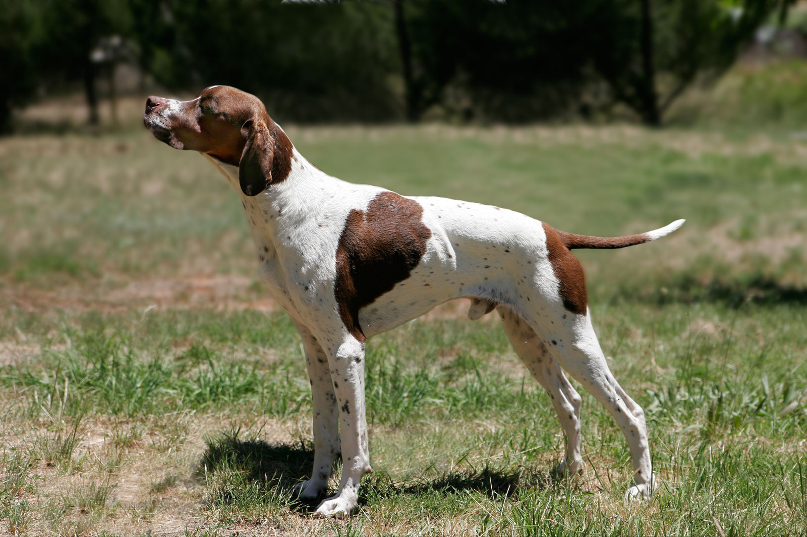

# Pointers and Arrays

 - Pointers in C
    - [Intro](https://github.com/sissa/spe_seed/blob/master/data_structures/playing_with_pointers.md)
       - Declaring a pointer.
       - Assigning a pointer.
       - Getting the reference to something.
       - Dereferentiate
   - [Pointers and References](https://github.com/sissa/spe_seed/blob/master/data_structures/pointers_and_references.md)
    - Pointers C++, fortran.
 - Intro to Memory Management
    - [Heap vs Stack](https://github.com/sissa/spe_seed/blob/master/data_structures/heap_vs_stack_memory.md) 
    - [Arrays C](https://github.com/sissa/spe_seed/blob/master/data_structures/pointers_and_arrays.md)
    - Arrays, C++, fortran.
    - [Multidimensional Array](https://github.com/sissa/spe_seed/blob/master/data_structures/multidimesional_arrays.c)
