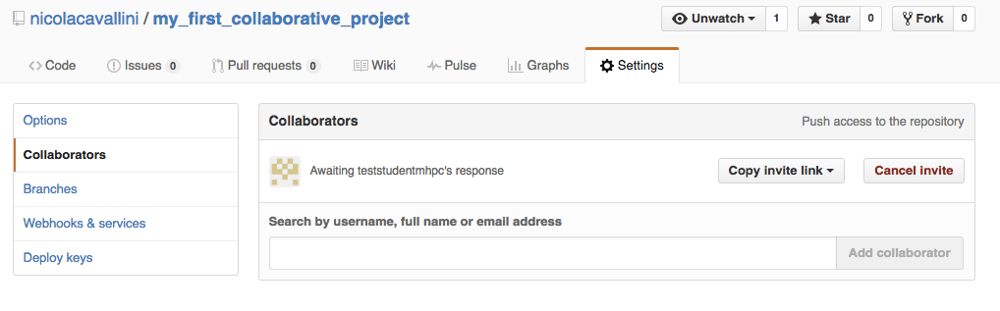

# My First Collaborative Project

First of all, choose who is `AStudent` and who is `BStudent`.

When `AStudent` works `Bstudent` controls and vice versa.

## What's a Remote?

  

## The Template Code

```
# A student's packagies

from mpl_toolkits.mplot3d import Axes3D
from matplotlib import cm
from matplotlib.ticker import LinearLocator, FormatStrFormatter
import matplotlib.pyplot as plt

# B student's packagies

import numpy as np

# B student's function

def eval_func():

    X = np.arange(-5, 5, 0.25)
    Y = np.arange(-5, 5, 0.25)
    X, Y = np.meshgrid(X, Y)
    R = np.sqrt(X**2 + Y**2)
    Z = np.sin(R)

    return X,Y,Z

# A student's function

def plot_func(X,Y,Z):

    fig = plt.figure()
    ax = fig.gca(projection='3d')

    surf = ax.plot_surface(X, Y, Z, rstride=1, cstride=1, cmap=cm.coolwarm,
                           linewidth=0, antialiased=False)
    ax.set_zlim(-1.01, 1.01)

    ax.zaxis.set_major_locator(LinearLocator(10))
    ax.zaxis.set_major_formatter(FormatStrFormatter('%.02f'))

    fig.colorbar(surf, shrink=0.5, aspect=5)

    plt.show()
    return

# B student writes the main

if __name__=="__main__":

    X,Y,Z = eval_func()
    plot_func(X,Y,Z)

```

## Collaborative Development


This is meant to be a simple collaborative project between `AStudent` and `BStudent`.

`AStudent` creates a directory and cd in it:

```
$ mkdir my_first_collabiorative_project
$ cd my_first_collabiorative_project
```

Stats a new file called `draw_a_graph.py` and places all the place holders where the two students are supposed to work. 
The skeleton of the code:

```
# A student's packagies


# B student's packagies


# B student's function

def eval_func():

    return X,Y,Z

# A student's function

def plot_func(X,Y,Z):

    return

# B student writes the main

if __name__=="__main__":
```

Before using git, we need to specify username and mail:

```
$ git config --global user.name "YOUR NAME"
$ git config --global user.email "YOUR EMAIL ADDRESS"
```

Now `AStudent` starts version controlling this repository using git:

```
$ git init
Initialized empty Git repository in /Users/nicola/mhpc/my_first_collaborative_project/.git/
```

`AStudent` asks git what's the status of the repository he created:

```
$ git status
On branch master

Initial commit

Untracked files:
  (use "git add <file>..." to include in what will be committed)

	draw_a_graph.py

nothing added to commit but untracked files present (use "git add" to track)

```

Now `AStudent` tells git he wants to track `draw_a_graph.py`:

```
$ draw_a_graph.py
```

Check the status again to make sure git understood correctly:

```
$ git status
On branch master

Initial commit

Changes to be committed:
  (use "git rm --cached <file>..." to unstage)

	new file:   darw_a_graph.py

```

Now git is suggesting us that the file is ready to be committed, and we agree with git in this case:

```
$ git commit -m "first commit"
[master (root-commit) 6c04ecd] first commit
 1 file changed, 21 insertions(+)
 create mode 100644 draw_a_graph.py
```

The developed repository is only local at the moment. Suppose we want to add a remote copy of our repository. To do this we sign in on github, and create a repository with the very same name (to simplify things) of our local repo, see the image:


We want to exchange information in between the local repository  and the remote one. To do this we need to tell git there exists a `url` (in the git language the remote it is just an url) that corresponds to our remote repository:

```
$ git remote add origin https://github.com/nicolacavallini/my_first_collaborative_project.git
```

By convention the first `remote` we add is called `origin`, but it's not mandatory.

To publish (`push` in the git language) our work on the repository we need to:

```
$ git push origin master
Username for 'https://github.com': nicolacavallini
Password for 'https://nicolacavallini@github.com': 
Counting objects: 3, done.
Delta compression using up to 4 threads.
Compressing objects: 100% (3/3), done.
Writing objects: 100% (3/3), 562 bytes | 0 bytes/s, done.
Total 3 (delta 0), reused 0 (delta 0)
To https://github.com/nicolacavallini/my_first_collaborative_project.git
 * [new branch]      master -> master
```

It is time for `BStudent` to join the game. To do so, `AStudent` has to give him permission to edit the project:



`BStudent` has to accept the invitation to collaborate, then he clones his own local version of the repository:

```
$ git clone https://github.com/nicolacavallini/my_first_collaborative_project.git
$ cd my_first_collaborative_project/
```

`BStudent` creates his own branch for his modifications:

```
$ git checkout -b eval_func
Switched to a new branch 'eval_func''
```


`BStudent` edits the function evaluation.

```
$ git status
On branch eval_func
Changes not staged for commit:
  (use "git add <file>..." to update what will be committed)
  (use "git checkout -- <file>..." to discard changes in working directory)

	modified:   draw_a_graph.py

no changes added to commit (use "git add" and/or "git commit -a")
```

We should be familiar by now with adding and committing our modifications:

```
$ git add draw_a_graph.py 
$ git commit -m "function evaluation"
[eval_func 579c6dc] function evaluation
 1 file changed, 6 insertions(+), 1 deletion(-)
```

`BStudent` has accomplished his task and so it pushes to the remote repository

```
$ git push origin eval_func
Counting objects: 3, done.
Delta compression using up to 4 threads.
Compressing objects: 100% (2/2), done.
Writing objects: 100% (3/3), 445 bytes | 0 bytes/s, done.
Total 3 (delta 0), reused 0 (delta 0)
To https://github.com/nicolacavallini/my_first_collaborative_project.git
 * [new branch]      eval_func -> eval_func
```
 
`AStudent` works on the same file but on the graph function:

```
$ git checkout -b graph_func
Switched to a new branch 'graph_func'
```

`AStudent` edits the graph func:

```
$ git diff
diff --git a/graph.py b/graph.py
index 48b5717..ed28f36 100644
--- a/graph.py
+++ b/graph.py
@@ -1,5 +1,10 @@
 # A student's packagies
 
+from mpl_toolkits.mplot3d import Axes3D
+from matplotlib import cm
+from matplotlib.ticker import LinearLocator, FormatStrFormatter
+import matplotlib.pyplot as plt
+
 
 # B student's packagies
 
@@ -14,6 +19,19 @@ def eval_func():
 
 def plot_func(X,Y,Z):
 
+    fig = plt.figure()
+    ax = fig.gca(projection='3d')
+
+    surf = ax.plot_surface(X, Y, Z, rstride=1, cstride=1, cmap=cm.coolwarm,
+                           linewidth=0, antialiased=False)
+    ax.set_zlim(-1.01, 1.01)
+
+    ax.zaxis.set_major_locator(LinearLocator(10))
+    ax.zaxis.set_major_formatter(FormatStrFormatter('%.02f'))
+
+    fig.colorbar(surf, shrink=0.5, aspect=5)
+
+    plt.show()
     return
 
 # B student writes the main
```

```
$ git add draw_a_graph.py 
$ git commit -m "graph func"
[graph_func 2317011] graph func
 1 file changed, 18 insertions(+)
$ git push origin graph_func
```

Now `BStudent` wants to write the main program. It is a good practice to work on different branches for different tasks. First, he gets back to the master branch:

```
$ git checkout master
Switched to branch 'master'
```

He moves to a new branch:

```
$ git checkout -b main
```

Then he edits the main part of the code:

```
$ git diff
diff --git a/graph.py b/graph.py
index 48b5717..301e07f 100644
--- a/graph.py
+++ b/graph.py
@@ -19,3 +19,5 @@ def plot_func(X,Y,Z):
 # B student writes the main
 
 if __name__=="__main__":
+    X,Y,Z = eval_func()
+    plot_func(X,Y,Z)
```

```
$ git add very_interesting_text.txt 
$ git commit -m "conclusion"
[master 047fddf] conclusion
 1 file changed, 1 insertion(+), 1 deletion(-)
$ git push origin conclusions
Counting objects: 3, done.
Delta compression using up to 4 threads.
Compressing objects: 100% (3/3), done.
Writing objects: 100% (3/3), 319 bytes | 0 bytes/s, done.
Total 3 (delta 1), reused 0 (delta 0)
To https://github.com/nicolacavallini/my_first_collaborative_project.git
 * [new branch]      conclusions -> conclusions
```

If we take a look at the `Network`, under `Graphs` sheat, on github page we see the status of the for branches `master`, `a_modification`, `b_modification` and `conclusions`.


`BStudent` now takes the responsibility to merge the work made on branch `eval_func`. To do so he has to `fetch` the informations on the remote branch:

```
$ git fetch
remote: Counting objects: 3, done.
remote: Compressing objects: 100% (2/2), done.
remote: Total 3 (delta 0), reused 3 (delta 0), pack-reused 0
Unpacking objects: 100% (3/3), done.
From https://github.com/nicolacavallini/my_first_collaborative_project
 * [new branch]      graph_func -> origin/graph_func
```

`Bstudent` goes back on `master` and merge branch `origin/a_modification` onto its *local* master branch:

```
$ git merge origin/graph_func
Updating 6c04ecd..2317011
Fast-forward
 graph.py | 18 ++++++++++++++++++
 1 file changed, 18 insertions(+)
```
Then, he pushes to origin
```
$ git push origin master
Total 0 (delta 0), reused 0 (delta 0)
To https://github.com/nicolacavallini/my_first_collaborative_project.git
   6c04ecd..2317011  master -> master
```


Now `AStudent` merges branch `origin/eval_func`:

```
$ git fetch
remote: Counting objects: 6, done.
remote: Compressing objects: 100% (3/3), done.
remote: Total 6 (delta 2), reused 5 (delta 1), pack-reused 0
Unpacking objects: 100% (6/6), done.
From https://github.com/nicolacavallini/my_first_collaborative_project
 * [new branch]      eval_func  -> origin/eval_func
 * [new branch]      main       -> origin/main
   6c04ecd..2317011  master     -> origin/master
$ git checkout master
Switched to branch 'master'
Your branch is behind 'origin/master' by 1 commit, and can be fast-forwarded.
  (use "git pull" to update your local branch)
```

Git is warning `AStudent` that his local branch is not up to date. To do so, `AStudent` needs to `pull` from the remote:

```
$ git pull origin master
From https://github.com/nicolacavallini/my_first_collaborative_project
 * branch            master     -> FETCH_HEAD
Updating 6c04ecd..2317011
Fast-forward
 graph.py | 18 ++++++++++++++++++
 1 file changed, 18 insertions(+)
```

`AStudent` can merge the work of `BStudent`. A default message will appear, committing the merging operation into a new commit:

```
$ git merge origin/eval_func
Auto-merging graph.py
Merge made by the 'recursive' strategy.
 graph.py | 7 ++++++-
 1 file changed, 6 insertions(+), 1 deletion(-)
$ git push origin master
```


The very same process can be operated for the branch `main`:

```
$ git merge origin/main
Auto-merging graph.py
Merge made by the 'recursive' strategy.
 graph.py | 2 ++
 1 file changed, 2 insertions(+) 
$ git push origin master 
```


